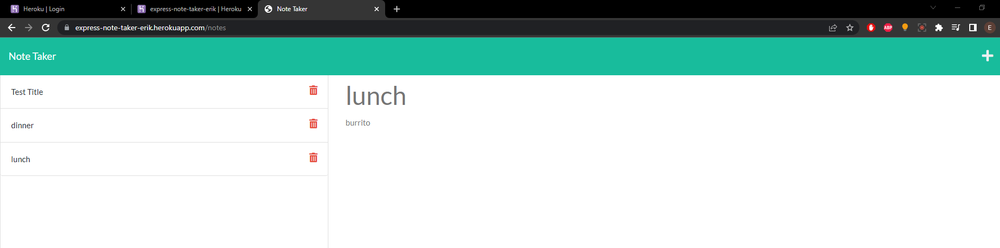

# Express Note Taker

## Table of Contents
* [Description](#description)
* [Installation](#installation)
* [Usage](#usage)
* [License](#license)
* [Contributing](#contributing)
* [Tests](#tests)
* [Questions](#questions)

## Description 
A note taker using express that saves data as an api. User is able to click on past notes and view them even after leaving the pages (in theory).

## Installation 
Express and Heroku

## Usage 
N/A

## License 
This project is licensed under the MIT License

## Contributing 
N/A

## Tests 
N/A

## Questions 
My GitHub username is neft-tk, and you can see more of my work at https://github.com/neft-tk 
You can also reach me at ebussman@gmail.com

;

https://express-note-taker-erik.herokuapp.com/notes